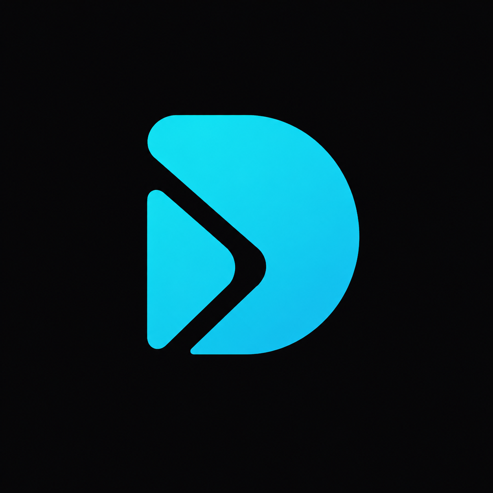

<div align="center">
 
  
</p>

# Source Design 

Source Design i a premium web application and developer utility designed to inspect, extract, and compile production-grade design tokens from live websites into semantic, ready-to-use configurations (Tailwind CSS, CSS variables, and JSON design tokens).

  <a href="https://x.com/Source__Design"></a>
  
</p>

<div align="left">

## Core Capabilities

### 1. Live Design Extractor
- Enter a website URL to automatically mine its active color palettes, font pairings, border radii, spacing systems, and custom properties.
- Maps raw extracted colors, sizes, and styling data into semantic components and tokens (e.g., `colors.primary`, `colors.canvas`, `typography.display-xl`).

### 2. Gallery of Design Systems
- Access a pre-extracted gallery of 22 leading digital products (Vercel, Supabase, Netflix, Perplexity, GitHub, and more) at `/designs`.
- Copy code-ready tokens instantly:
  - **`DESIGN.md`**: Editorial-style overview of the website's design philosophy.
  - **`tailwind.css`**: Tailwind v4 `@theme` configuration.
  - **`variables.css`**: CSS Custom Properties (`:root`).
  - **`tokens.json`**: Standard JSON Design Tokens.

### 3. Your Website (Theme Sandbox)
- Visual-test how any design system applies to complete page layouts.
- Previews the active theme dynamically on fully connected pages (Hero, Features grid, FAQ accordion, Contact form, and About grids).
- Real-time token modifications (canvas background, line border contrast, accent actions, radii).

### 4. Your Design (AI Design Studio)
- A progressive, AI-powered design environment (similar to Claude's Artifacts).
- **Phases**: AI reasons about layout spacing/typography (`Thinking`) → writes an itemized checklist (`Plan`) → builds the component with checkboxes updating in real-time (`Building`) → delivers a single-page HTML/CSS/JS preview in an iframe.
- **Self-Correction**: Automatically catches runtime Javascript errors in the iframe and requests a self-correction pass from the AI.
- **Provider Choice**: Choose local **Ollama** (absolutely free using `gemma4:31b-cloud`) or bring your own API key for **Google Gemini**, **OpenAI**, or **Anthropic**.

### 5. MCP & CLI
- **Model Context Protocol (MCP)**: Exposes the extraction and proposal tools directly to AI coding assistants (like Cursor, Windsurf, or Claude Desktop). Helps the AI pair programmer suggest real-world design tokens matching any design.
- **Command Line Interface (CLI)**: Query design tokens directly from your terminal.

---

## Getting Started

### Prerequisites
- Node.js (v18+)

### Installation
1. Clone the repository and install dependencies:
   ```bash
   npm install
   ```
2. Start the local development server:
   ```bash
   npm run dev
   ```
3. Open [http://localhost:3000](http://localhost:3000) in your browser.

---

## Configuring the AI Design Studio (Your Design)

Click the **⚙ settings button** in the `/your-design` page to set up your AI engine:

### Option A: Local Ollama (Free)
1. Download and install [Ollama](https://ollama.com).
2. Set the CORS environment variable in a new terminal so the web app can connect to your local Ollama port:
   - **Windows (PowerShell)**:
     ```powershell
     $env:OLLAMA_ORIGINS="*" ; ollama serve
     ```
   - **Mac/Linux (Terminal)**:
     ```bash
     OLLAMA_ORIGINS="*" ollama serve
     ```
3. In a separate terminal, pull the required model:
   ```bash
   ollama run gemma4:31b-cloud
   ```
4. Click **Refresh status** in the web settings to see the connection turn **Online**.

### Option B: Secure Tunnel (For Deployed HTTPS sites)
If you are using the deployed HTTPS version of the site, browsers block unencrypted HTTP local connections.
1. Run a local secure tunnel:
   ```bash
   ngrok http 11434
   ```
2. Copy the secure HTTPS URL (e.g. `https://xxxx.ngrok-free.app`) and paste it as the **Ollama Endpoint URL** in the settings.

### Option C: Bring Your Own API Key
Choose Google Gemini (`gemini-2.5-flash`), OpenAI (`gpt-4o-mini`), or Anthropic (`claude-sonnet-4`) and input your API key. Keys are saved strictly in your browser's local storage.

---

## Running MCP and CLI

### Running the CLI
Run the interactive CLI tool directly from the project directory:
```bash
npm run cli
```
Or run the built package:
```bash
npx ./cli
```

### Running the MCP Server
Register the MCP server in your AI editor settings (Cursor / Windsurf) or Claude Desktop Configuration:
- **Command**: `node`
- **Arguments**: `[path/to/Source Design]/cli/index.js`
- **Environment**: Add necessary path environment variables.

---

## Directory Structure

```text
├── app/                  # Next.js App Router (pages and API routes)
│   ├── api/              # Extractor, proposals, and AI generation endpoints
│   ├── designs/          # Design details & gallery pages
│   ├── your-design/      # AI Design Studio workspace
│   ├── your-website/     # Theme Sandbox workspace
│   └── page.jsx          # Home page interface
├── components/           # Reusable UI components (SiteHeader, progressive UI elements, etc.)
├── cli/                  # CLI and Model Context Protocol (MCP) server implementation
├── lib/                  # Extraction engine and Ready Designs data
│   ├── ready/            # Pre-extracted JSON definitions for 22 sites
│   ├── extract.js        # Core token parsing and mapping engine
│   └── providers.js      # Multi-provider cloud model clients
├── public/               # Public assets, transparent PNG logos, and CLI tarball
└── package.json          # Dependency and script definitions
```
## Star History

<a href="https://www.star-history.com/?type=date&repos=Source-Design%2FSource-Design">
 <picture>
   <source media="(prefers-color-scheme: dark)" srcset="https://api.star-history.com/chart?repos=Source-Design/Source-Design&type=date&theme=dark&legend=top-left" />
   <source media="(prefers-color-scheme: light)" srcset="https://api.star-history.com/chart?repos=Source-Design/Source-Design&type=date&legend=top-left" />
   
 </picture>
</a>

